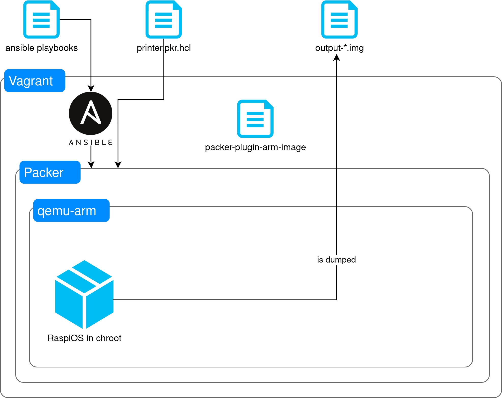
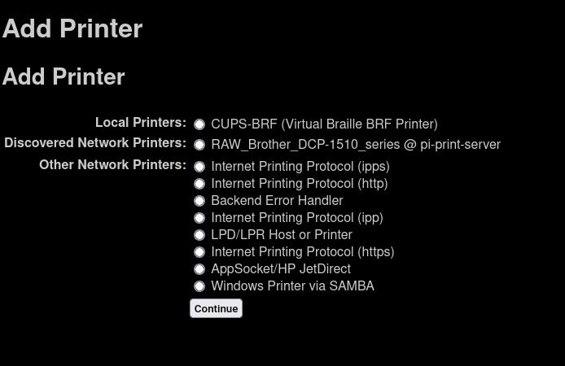
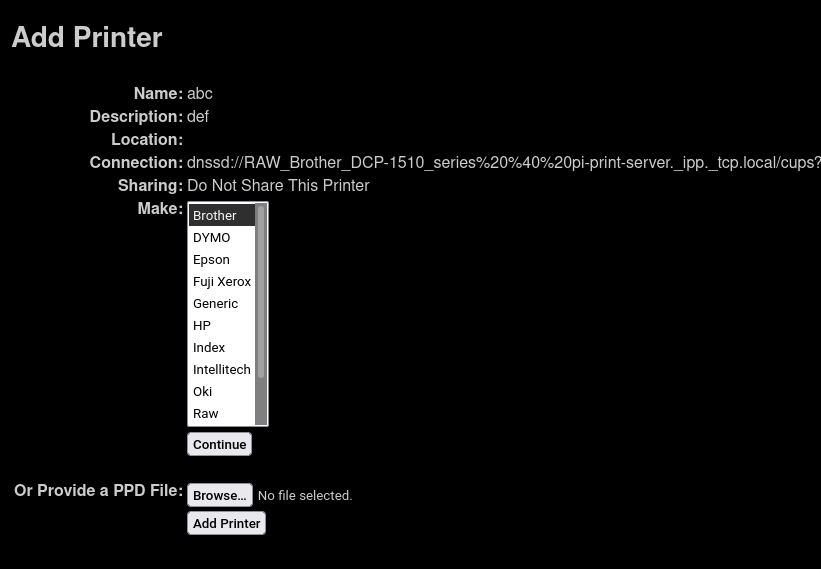

# USB printer over wifi

This project configures and builds an ARM RaspiOS image it to share local USB printers over WiFi in raw queue mode.

My setup consists of a [Raspberry Pi Zero](https://www.raspberrypi.com/products/raspberry-pi-zero/) and Brother DCP-1510 printer, but it should work with any USB printer.

## Building, flashing and running the image



### Prerequisites

Clone this repository along with submodules:

```shell
git clone --recurse-submodules https://github.com/maciekmm/printer-rpi-image.git 
```

### Building 

The build process uses [Packer](https://packer.io), [packer-plugin-arm-image](https://github.com/solo-io/packer-plugin-arm-image) and [Vagrant](https://vagrantup.com).

You will need to install `vagrant` and `virtualbox` or a similiar virtualization software. You can also run packer directly, but I haven't tried it and it's not recommended.

In order to build the image, run the following command. Substitute `<SSID>`, `<WIFI_PASSWORD>` `<SSH_PUBLIC_KEY>` with appropriate values.

```shell
WIFI_SSID=<SSID> WIFI_PASSWORD=<PASSWORD> SSH_PUBLIC_KEY=$(cat ~/.ssh/id_ed25519.pub) vagrant up
```

This will take a while, an image should be available under `./output-raspberry_pi_os.img`.

### Flashing

1. Connect SD card / flash drive and find which device file in `/dev` belongs to it, e.g. via `lsblk`. In my case it's `/dev/mmcblk0`.
2. Flash the image by running `dd bs=4M if=./output-raspberry_pi_os.img of=<deviceyouhaveidentified> && sync`, this might take a while.

### Live configuration

This step will:
- update the system,
- detect connected printers and configure them in RAW queue mode,
- configure the firewall.

1. Boot your ARM device and connect printers to it.
2. Navigate to `./ansible/` folder by running `cd ./ansible`
3. Run `live.yaml` playbook by running `ansible-playbook  -i hosts live.yaml`

You should be able to ssh into the Pi by running `ssh pi@pi-print-server.local`,  if you are unable to do so, check your router and find out which ip address the Pi got assigned. If no entry is present check your WiFi credentials.

### Local setup

As this exposes the printer in RAW queue mode, you will need to configure the driver and the printer locally.

This is heavily dependant on the manufacturer, operating system you use and other factors.

#### Linux

For Linux installations you will need `cups` and dnssd mDNS resolver. 

The driver will depend on the printer manufacturer.

The printer should be automatically discovered by `cups` in `Add Printer` section.



You should choose the actual driver in this step, don't choose RAW.



## FAQ

### Why is RAW queue mode used? Can't we use proper drivers?

We could, but usually the ARM devices that run RaspiOS are underpowered. Many old drivers require ghostscript to process the data sent to the printer which is a computationally expensive process. Using drivers on the client side (your PC or laptop) offloads that computation to a more powerful device. If your embedded device is powerful enough you can go install appropriate drivers and configure printer to use it.

### What about the scanner?

I rarely use the scanner on my printer, so setting it up to be available over network doesn't have too high of a priority for me.